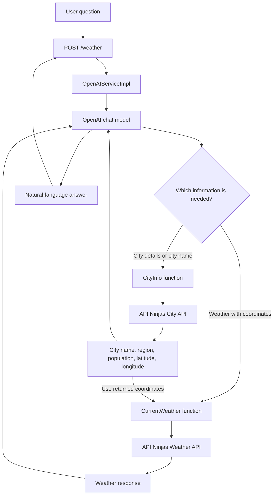

# Spring AI Functions

This is a small Spring Boot application that demonstrates how to expose a Java
function to an OpenAI chat model with Spring AI. The model can call a weather
function backed by [API Ninjas](https://api-ninjas.com/api/weather), then use
the returned data to answer a natural-language question.

## How it works

1. The application accepts a question at `POST /weather`.
2. Spring AI sends the question and the `CurrentWeather` function definition to
   OpenAI.
3. When weather data is needed, the model calls the Java
   `WeatherServiceFunction`.
4. The function calls API Ninjas using the latitude and longitude supplied by
   the model.
5. The model turns the weather response into a useful answer.



The function input is a latitude and longitude:

```json
{
  "lat": "53.350140",
  "lon": "-6.266155"
}
```

The response model includes the current condition, temperatures, humidity,
cloud coverage, wind, sunrise and sunset times, and the available weather
icons.

## Requirements

- Java 21
- Maven 3.9+ (or the included Maven Wrapper)
- An [OpenAI API key](https://platform.openai.com/api-keys)
- An [API Ninjas API key](https://api-ninjas.com/)

## Configuration

Set both API keys in the environment before starting the application. The
application reads them from `OPENAI_API_KEY` and `API_NINJAS_KEY`; keys are
never intended to be committed to the repository.

```bash
export OPENAI_API_KEY="your-openai-api-key"
export API_NINJAS_KEY="your-api-ninjas-key"
```

On Windows PowerShell:

```powershell
$env:OPENAI_API_KEY = "your-openai-api-key"
$env:API_NINJAS_KEY = "your-api-ninjas-key"
```

## Run the application

Start the application with the Maven Wrapper:

```bash
./mvnw spring-boot:run
```

On Windows:

```powershell
.\mvnw.cmd spring-boot:run
```

The server listens on `http://localhost:8080`.

## Try it with curl

These examples can be pasted directly into a terminal while the application
is running.

### Dublin: outdoor clothes recommendation

```bash
curl --location 'http://localhost:8080/weather' \
  --header 'Content-Type: application/json' \
  --data '{
    "question": "What is the current weather at latitude 53.350140 and longitude -6.266155 in Dublin? Use metric units. Is it a good day to dry clothes outside? Explain your recommendation using the rain, humidity, wind, and temperature."
  }'
```

Example response:

```json
{
  "answer": "The current weather in Dublin at latitude 53.350140 and longitude -6.266155 is 11°C with moderate rain. The humidity is quite high at 92%, and the wind is blowing at a speed of 3.6 km/h.\n\nGiven these conditions, it would not be a good day to dry clothes outside. The rain and high humidity mean that the clothes would not dry properly and may even get wetter if left outside. The wind, while not particularly strong, would not be enough to counteract the effects of the rain and humidity. Furthermore, the temperature is relatively low, which means the evaporation rate would be slow, making the drying process much longer."
}
```

### New York: commute planning

```bash
curl --location 'http://localhost:8080/weather' \
  --header 'Content-Type: application/json' \
  --data '{
    "question": "Check the weather at latitude 40.7128 and longitude -74.0060 in New York City. Should I bring an umbrella and a jacket for a 30-minute walk? Give a concise answer in Fahrenheit and miles per hour."
  }'
```

Example response:

```json
{
  "answer": "The current weather in New York City is clear with a temperature of 62.6°F (converted from 17°C). The wind speed is approximately 11.5 miles per hour (converted from 5.14 m/s). Given these conditions, you won't need an umbrella. As for the jacket, it depends on your personal comfort level with this temperature. If you feel cold at around 63°F, you might want to bring a jacket for your 30-minute walk."
}
```

### Sydney: compare conditions with a specific activity

```bash
curl --location 'http://localhost:8080/weather' \
  --header 'Content-Type: application/json' \
  --data '{
    "question": "What is the weather at latitude -33.8688 and longitude 151.2093 in Sydney? Is it suitable for an outdoor lunch right now? Mention the temperature, cloud cover, wind, and whether rain is expected."
  }'
```

Example response:

```json
{
  "answer": "The current weather in Sydney is overcast with a cloud cover of 99%. The temperature is 15°C (59°F), with a wind speed of 12.35 km/h (7.67 mph) coming from the south. The humidity is at 62%. There's no mention of rain, but with such heavy cloud cover, you might want to keep an eye on the weather updates before deciding on an outdoor lunch."
}
```

The request body contains one natural-language question. Include the location's
latitude and longitude in the question so the model can populate the weather
function arguments reliably. For city-based questions, provide a city name
instead; the model can call `CityInfo` first and pass the returned coordinates
to `CurrentWeather`. The model can convert units and tailor the answer, but the
weather service itself returns metric values.

### CityInfo: city profile

This request uses only `CityInfo` to look up facts about a city:

```bash
curl --location 'http://localhost:8080/weather' \
  --header 'Content-Type: application/json' \
  --data '{
    "question": "Tell me about San Francisco. Which country and region is it in, what is its population, what are its coordinates, and is it a national capital?"
  }'
```

Example response:

```json
{
  "answer": "San Francisco is located in the region of California, United States. It is not a national capital. The population of San Francisco is approximately 3,592,294 people. The coordinates for San Francisco are approximately 37.7562° N latitude and -122.443° E longitude."
}
```

### CityInfo: resolve an ambiguous city

This is useful for seeing how the assistant handles a city name that may refer
to multiple places:

```bash
curl --location 'http://localhost:8080/weather' \
  --header 'Content-Type: application/json' \
  --data '{
    "question": "Find information about Springfield, including its country, region, population, and coordinates. If there are multiple possible cities, list the matches and ask me which one I mean."
  }'
```

Example response:

```json
{
  "answer": "Springfield is located in the region of Massachusetts, United States. It has a population of approximately 623,401 people. The city's coordinates are 42.1155° latitude and -72.5395° longitude."
}
```

> **Note:** This run returned only one Springfield match, so the assistant did
> not ask for clarification. The city lookup API or model may select a single
> result instead of exposing every possible match. For reliable results, include
> a state, region, or country in the question when a city name is ambiguous.

### CityInfo + CurrentWeather: plan an outdoor wedding

This request asks for city facts and current conditions. The assistant should
look up the city first, then use the returned coordinates for weather:

```bash
curl --location 'http://localhost:8080/weather' \
  --header 'Content-Type: application/json' \
  --data '{
    "question": "We are planning an outdoor wedding in Florence, Italy. First identify the city and region, then check the current weather there. Is the weather suitable for a ceremony and dinner outside? Include temperature, rain, humidity, wind, and cloud cover in Celsius and km/h."
  }'
```

Example response:

```json
{
  "answer": "Florence is a city in the Tuscany region of Italy. \n\nAs for the current weather, it is clear with 3% cloud cover. The temperature is 19°C. The humidity is at 60%. There is a very light breeze blowing at a speed of 1.03 km/h. There is no report of any rain.\n\nConsidering these factors, the weather seems quite suitable for an outdoor wedding ceremony and dinner. However, please note that weather conditions can change rapidly, so you may want to have a backup plan in place."
}
```

### CityInfo + CurrentWeather: choose a hiking destination

This example combines location lookup, weather retrieval, and a practical
recommendation:

```bash
curl --location 'http://localhost:8080/weather' \
  --header 'Content-Type: application/json' \
  --data '{
    "question": "I am choosing between a day hike near Vancouver, Canada and one near Seattle, USA. Use city information and current weather for both places, then compare the conditions and recommend which location is better. Use Fahrenheit and miles per hour."
  }'
```

Example response:

```json
{
  "answer": "Here is the comparison between the two locations:\n\n**Vancouver, Canada:**\n- Weather: Overcast clouds\n- Temperature: 18°C (64.4°F)\n- Humidity: 75%\n- Wind Speed: 4.47 m/s (10 mph)\n\n**Seattle, USA:**\n- Weather: Overcast clouds\n- Temperature: 18°C (64.4°F)\n- Humidity: 72%\n- Wind Speed: 5.66 m/s (12.7 mph)\n\nGiven the similar weather conditions, humidity, and temperature, both locations are suitable for a hike. However, Vancouver has slightly less wind speed which may be more favorable for hiking. Therefore, I would recommend Vancouver, Canada for your day hike."
}
```

### CityInfo + CurrentWeather: sunrise photography

Ask for city metadata and weather context for a specific activity:

```bash
curl --location 'http://localhost:8080/weather' \
  --header 'Content-Type: application/json' \
  --data '{
    "question": "I want to photograph sunrise in Reykjavik, Iceland. Identify the city, then check its current weather and tell me whether the conditions look promising for outdoor photography. Mention cloud cover, rain, wind, temperature, and the city coordinates."
  }'
```

Example response:

```json
{
  "answer": "Reykjavik, the capital of Iceland, is located at the coordinates 64.1475° N, -21.935° W. It has a population of approximately 128,793 people.\n\nAs for the current weather in Reykjavik, it is characterized by scattered clouds with a cloud cover of 43%. The temperature is currently 3°C (37.4°F) and it feels like 1°C (33.8°F). The wind is blowing from the southeast at a speed of 2.06 m/s (4.6 mph). There is no rain reported.\n\nGiven these conditions, it seems like you might have a decent chance of capturing a beautiful sunrise, assuming the cloud cover doesn't become too dense. Safe travels and happy photographing!"
}
```

## Build and test

Compile and package without running tests:

```bash
./mvnw -DskipTests package
```

Run the test suite:

```bash
./mvnw test
```

Tests that load the Spring context require `OPENAI_API_KEY` and
`API_NINJAS_KEY` to be configured.

## Project structure

| Path                                  | Purpose                                               |
|---------------------------------------|-------------------------------------------------------|
| `services/OpenAIServiceImpl`          | Builds the prompt and registers the function callback |
| `functions/WeatherServiceFunction`    | Calls API Ninjas with latitude and longitude          |
| `functions/CityServiceFunction`       | Looks up city information by name                    |
| `model/WeatherRequest`                | Schema supplied to the model for function arguments   |
| `model/WeatherResponse`               | Maps the API Ninjas weather response                  |
| `model/CityRequest`                   | Schema supplied to the model for city lookups         |
| `model/CityResponse`                  | Maps city lookup results                              |
| `controllers/QuestionController`      | Exposes `POST /weather`                               |
| `src/main/resources/application.yaml` | Spring AI and environment-variable configuration      |

## Related Spring Framework Guru courses

- [Spring Framework 6 - Beginner to Guru](https://www.udemy.com/course/spring-framework-6-beginner-to-guru/)
- [API First Engineering with Spring Boot](https://www.udemy.com/course/api-first-engineering-with-spring-boot/)
- [Introduction to Kafka with Spring Boot](https://www.udemy.com/course/introduction-to-kafka-with-spring-boot/)
- [Spring Framework Guru blog](https://springframework.guru/)
